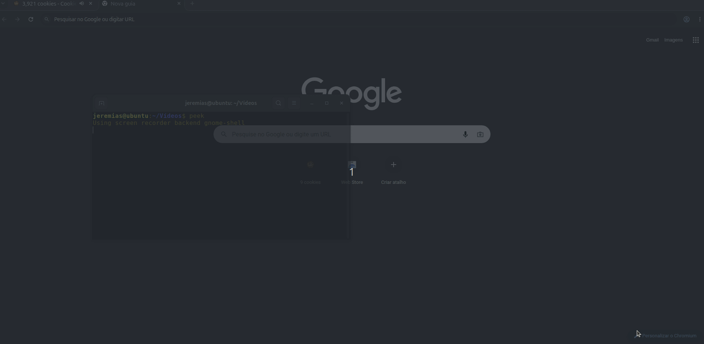

# *Clicke Cockie  botcity v1*  

### _Uma simples automação do jogo [clicke cockie](https://orteil.dashnet.org/cookieclicker/) onde o programa farma, da upgrades e compra melhorias de forma automatica enquanto você navega na internet_ 
#

# *Observações🔍​*

### _Obs1.:  Todo site que é carregado em JS, ao ser aberto, ele precisa ficar carregando a cada animação que acontece no site quando está em vizualização. Sendo assim, o robô vai clicar mais lento quando você estiver vizualizando ele. Para que ele va mais rápido, abra outra aba e deixe ele rodando sem que vizualize ele!!  Abaixo irei deixar um video irei deixar um gif de comparação de velocidade: _

### _Obs2.:  sempre você for rodar o código, ele vai abrir um site com menssagem de erro. Não se preocupe, faz parte do código. O que o botcity tenta fazer é um "drible" para evitar que o site identifique que o que está operando o site é um robô e peça verificação de humano.  imagem de exemplo: _

  

### _Obs3.:  Certifique-se de ter o chromium instalado no seu pc/notebook_

# _Arvore do projeto arvore_ 🪾​⌨️​

    .
    ├── LICENSE
    ├── logs
    │   ├── 03
    │   │   └── 09
    │   │       └── 26
    │   │           └── pasta_log.log
    │   ├── 04
    │   │   └── 09
    │   │       └── 26
    │   │           └── pasta_log.log
    │   └── 05
    │       └── 09
    │           └── 26
    │               └── pasta_log.log
    ├── midias
    │   ├── automatizador_cockie.jpg
    │   ├── Captura_de_tela_de_2026-09-05 01-14-55.png
    │   └── comparacao_click_cockie.gif
    ├── poetry.lock
    ├── __pycache__
    │   └── bot.cpython-312.pyc
    ├── pyproject.toml
    ├── README.md
    ├── test.py
    └── uteis
        ├── tratamento_bot
        │   ├── bot.py
        │   ├── __init__.py
        │   └── __pycache__
        │       ├── bot.cpython-312.pyc
        │       └── __init__.cpython-312.pyc
        └── tratamento_log
            ├── __init__.py
            ├── logger.py
            └── __pycache__
                ├── __init__.cpython-312.pyc
                └── logger.cpython-312.pyc
#
 

# _Ferramentas⚒️​⚙️​_

    - botcity
    - os
    - poetry
    - git
    - logging
    - datetime
    - git
    - linux(ubuntu)
#
 

# _Instalação<\\>🧩​_
    bash
        pip install poetry
        poetry install
#

# _Lincensa📃​_

#
# _Contato/Redes📲​_

